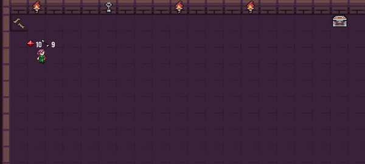
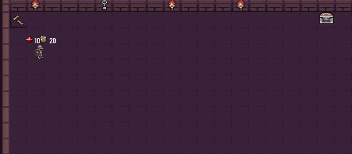
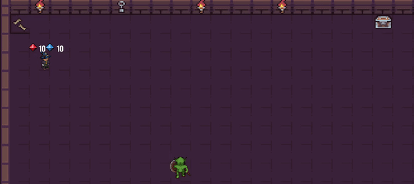

# Project_Alpha
Project_Alpha è un video-game ad ambientazione dungeon, dove il giocatore nelle veste di un *HERO* di classe *ARCHER*, *KNIGHT* o *MAGE*, deve sconfiggere nemici disseminaati in 9 stanze e trovare la chiave che apre la decima ed ultima stanza che nascondo il boss finale, l'innominabile *********.
(**Progetto realizzato per l'esame di programmazione, Univesità degli Studi di Firenze**)
## Comandi
`A` -> muovi a sinistra 
`D` -> muovi a destra 
`W` -> muovi in alto 
`S` -> muovi in basso 
`E` -> apri le chest 
`SPAZIO` -> attacca 
--->La navigazione dei menù è affidata al `MOUSE/TOUCHPAD`

